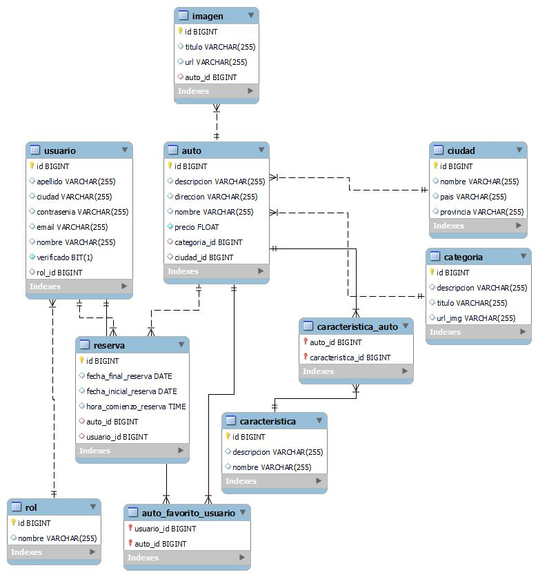
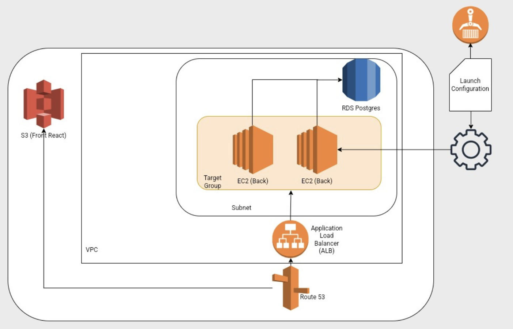

# Documentación Técnica

Para levantar el entorno y correr el proyecto de manera local, te sugerimos seguir estas instrucciones.

## Para el Front End

### 1. Requisitos

- `node`
- `npm`

### 2. Instalación

```plaintext
    # 1. Moverse al directorio client
    cd client

    # 2. Instalar dependencias
    npm install
```

### 3. Configuración

```plaintext
    # Hot Reload -> Cada cambio que hagas, va a levantar el servidor para ver los cambios.
    # 3. Para correr en desarrollo
    npm run dev

    # 4. Cuando finalizas el desarrollo, para construir
    npm run build
```

---

## Para el Back End

### 1. Requisitos

- `openjdk-18`
- `maven`

### 2. Ejecución

```plaintext
    # 1. Moverse al directorio del proyecto
    cd DigitalBooking

    # 2. compilar para desarrollo
    ./mvnw clean package

    # 2.1 compilar para produccion
    # agregar el tag -P
    ./mvnw clean install -Pprod

    # 3. correr
    java -jar DigitalBookin/target/DigitalBooking-0.0.1-SNAPSHOT.jar
```

#### 2.1 Ejecución con Docker (para producción)

```plaintext
    # 1. Moverse al directorio del proyecto
    cd DigitalBooking

    # 2. construir la imagen
    docker build -t api-digitalbooking:0.0.1 .

    # 3. correr por primera vez
    docker run -p 8080:8080 -d --name API-DH-v0.0.1 api-digitalbooking:0.0.1

    # 3.1 iniciar o parar el contenedor
    docker container start API-DH-v.0.0.1
    docker container stop API-DH-v.0.0.1
```

## ENDPOINTs

Accede a la documentación Back End mediante `https://api.monkeydbooking.com.ar/swagger-ui/index.html`

## Buenas Prácticas para Commits y Branches

### Commits

Para mantener las buenas prácticas utilizadas durante todo el proyecto, sugerimos mantener el siguiente formato de commits.

**\[ESTADO DEL CAMBIO\] #NumeroUserStory - "Explicación de que se hizo"**

#### Estados del cambio

- \[NUEVO\] -> Cuando la funcionalidad es completamente nueva y se agrega por primera vez al commit.
- \[ARREGLADO\] -> Cuando una funcionalidad genera un error y se arregla correctamente.
- \[MODIFICADO\] -> Cuando se agrega lógica o más funcionalidades a un componente/función.
- \[ELIMINADO\] -> Cuando una funcionalidad deja de ser útil y se elimina.

#### Ejemplos prácticos

```plaintext
git commit -m "[NUEVO] #3 - se creo la función para los endpoints"
git commit -m "[ARREGLADO] #3 - se corrigió el error generado por el tipo de dato que devuelve la funcion"
git commit -m "[MODIFICADO] #3 - Se agrego propiedad km con bean de getter y setter"
git commit -m "[ELIMINADO] #3 - Se eliminó la función buscarPorModelo"
```

### Branches

La utilización y creación de ramas está establecida para que cada integrante pueda crear una y hacer los cambios pertinentes en las mismas. Cuando todo esté listo, se mergeará con otra o bien con dev si el equipo está de acuerdo.

_Importante: No olvidar hacer pull antes de push._

Para crear una rama nueva se aconseja la nomenclatura:

**Inicial de Sprint numero de sprint - numero de tarea**

#### Ejemplo

`git branch S1-1`

## Base de datos

### Estructura de nuestra base de datos en Workbench



### Script para la creación de base de datos

1. Descargar el siguiente archivo: [data.sql](uploads/d8414de4b8cacdf3ff8e8679d844d34d/data.sql)
2. Abrir un sql Script en MySql Workbench
3. Ejecutar

## Infraestructura



## Testing

A continuación un informe sobre el recorrido de los test efectuados en cada uno de los sprints.

[Testing_PI-G2_.xlsx](uploads/aef3eeaf5afdf44d585fe228359fc3b3/Testing_PI-G2_.xlsx)